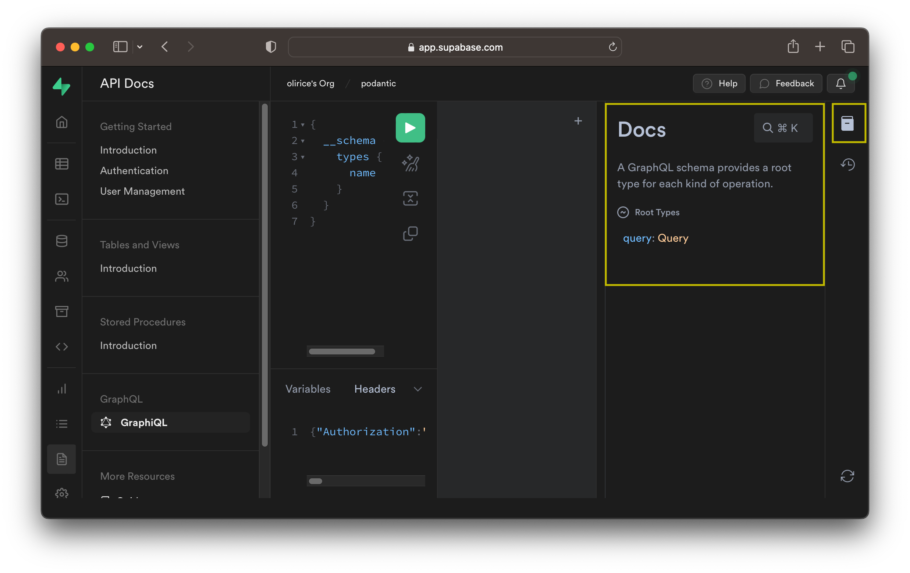
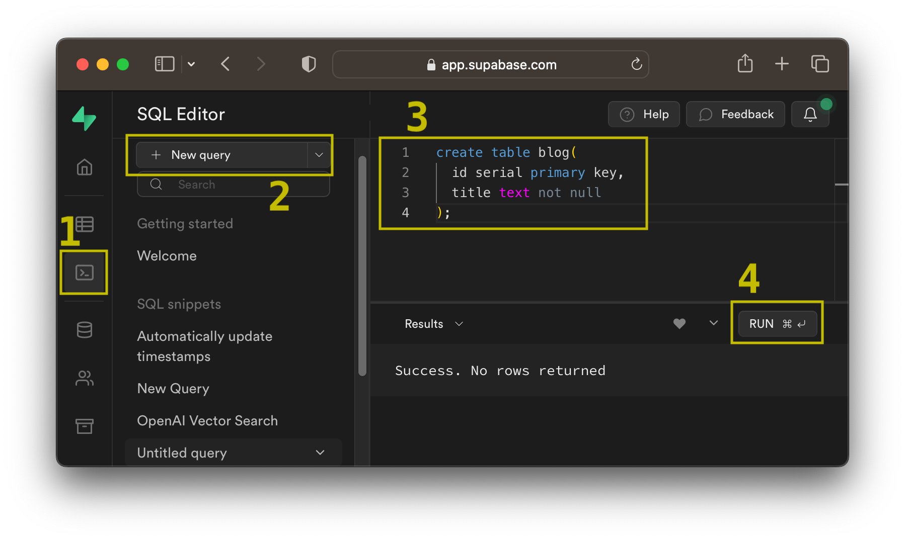
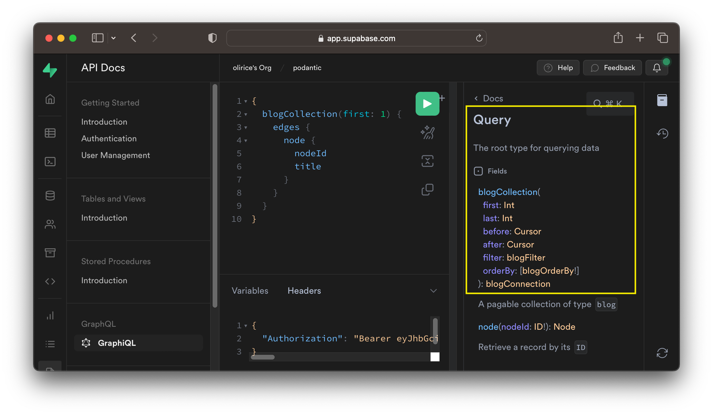
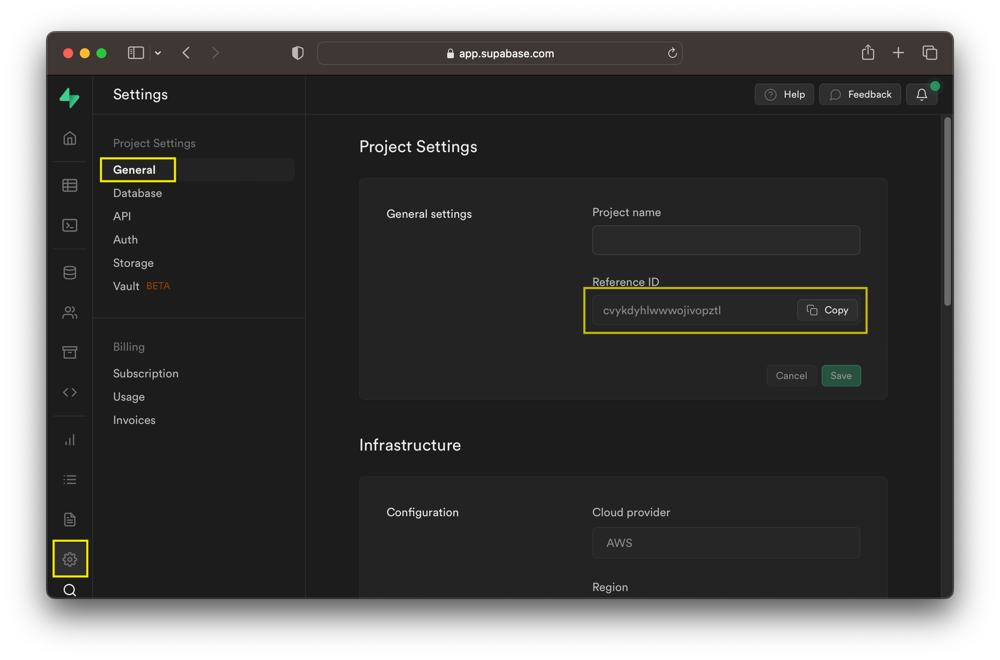
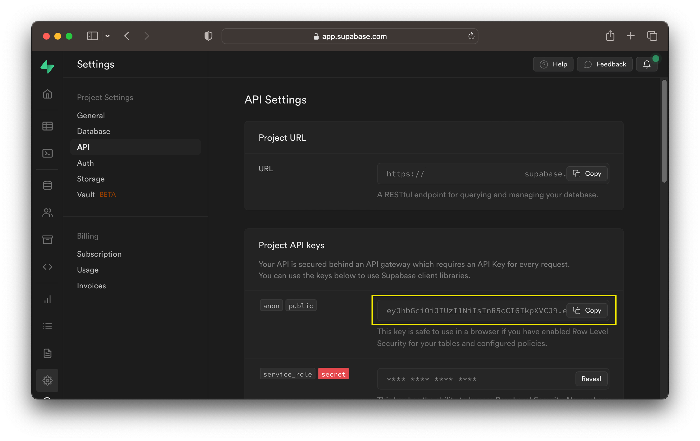

The Supabase GraphQL API is automatically reflected from your database's schema using [pg_graphql](https://github.com/supabase/pg_graphql). It supports:

- Basic CRUD operations (Create/Read/Update/Delete)
- Support for Tables, Views, Materialized Views, and Foreign Tables
- Arbitrarily deep relationships among tables/views
- User defined computed fields
- Postgres' security model - including Row Level Security, Roles, and Grants

All requests resolve in a single round-trip leading to fast response times and high throughput.

If you haven't created a Supabase project, do that [here](https://database.new) so you can follow along with the guide.

## Clients

If you're new to GraphQL or Supabase, we strongly recommend starting with Supabase GraphQL by following the [Supabase Studio guide](#supabase-studio).

For more experienced users, or when you're ready to productionize your application, access the API using [supabase-js](#supabase-js), [GraphiQL](#connecting-graphiql), or any HTTP client, for example [cURL](#curl).

### Supabase Studio

The easiest way to make a GraphQL request with Supabase is to use [Supabase Studio's builtin GraphiQL IDE](https://app.supabase.com/project/_/api/graphiql).
You can access GraphiQL [here](https://app.supabase.com/project/_/api/graphiql) by selecting the relevant project. Alternatively, navigate there within Studio at `API Docs > GraphQL > GraphiQL`.


Type queries in the central query editor and use the green icon to submit requests to the server. Results are shown in the output display to the right of the editor.

To explore the API visually, select the docs icon shown below and navigate through each type to see how they connect to the Graph.



pg_graphql mirrors the structure of the project's SQL schema in the GraphQL API. If your project is new and empty, the GraphQL API will be empty as well, with the exception of basic introspection types. For a more interesting result, go to the SQL or table editor and create a table.



Head back to GraphiQL to see the new table reflected in your GraphQL API's Query and Mutation types.



If you'd like your type and field names to match the GraphQL convention of `PascalCase` for types and `camelCase` for fields, check out the [pg_graphql inflection guide](/pg_graphql/configuration/#inflection).

### HTTP Request

To access the GraphQL API over HTTP, first collect your [project reference](#project-reference-project_ref) and [API Key](#api-key-api_key).

### cURL

To hit the Supabase GraphQL API using cURL, submit a `POST` request to your GraphQL API's URL shown below, substituting in your [PROJECT_REF](#project-reference-project_ref) and passing the project's [API_KEY](#api-key-api_key) as the `apiKey` header:


```sh
curl -X POST https://<PROJECT_REF>.supabase.co/graphql/v1 \
    -H 'apiKey: <API_KEY>' \
    -H 'Content-Type: application/json' \
    --data-raw '{"query": "{ accountCollection(first: 1) { edges { node { id } } } }", "variables": {}}'
```

In that example, the GraphQL `query` is
```graphql
{
  accountCollection(first: 1) {
    edges {
      node {
        id
      }
    }
  }
}
```

and there are no `variables`
```js
{}
```

### supabase-js

The JS ecosystem supports multiple prominent GraphQL frameworks. [supabase-js](https://supabase.com/docs/reference/javascript/introduction) is unopinionated about your GraphQL tooling and can integrate with all of them.

For an example integration, check out the [Relay guide](/pg_graphql/usage_with_relay), complete with Supabase Auth support.

### GraphiQL

If you'd prefer to connect to Supabase GraphQL using an external IDE like GraphiQL, save the HTML snippet below as `supabase_graphiql.html` and open it in your browser. Be sure to substitute in your [PROJECT_REF](#project-reference-project_ref) and [API_KEY](#api-key-api_key) beneath the `EDIT BELOW` comment:


```html
<html>
  <head>
    <title>GraphiQL</title>
    <link href="https://cdnjs.cloudflare.com/ajax/libs/graphiql/2.4.7/graphiql.css" rel="stylesheet" />
  </head>
  <body style="margin: 0;">
    <div id="graphiql" style="height: 100vh;"></div>
    <script crossorigin src="https://unpkg.com/react@18/umd/react.production.min.js"></script>
    <script crossorigin src="https://unpkg.com/react-dom@18/umd/react-dom.production.min.js"></script>
    <script
      crossorigin
      src="https://cdnjs.cloudflare.com/ajax/libs/graphiql/2.4.7/graphiql.js"
    ></script>
    <script>

      ////////////////
      // EDIT BELOW //
      ////////////////

      const fetcher = GraphiQL.createFetcher({
        url: 'https://<PROJECT_REF>.supabase.co/graphql/v1',
        headers: {
          "apiKey": "<API_KEY>",
        }
      });
      ReactDOM.render(
        React.createElement(GraphiQL, { fetcher: fetcher }),
        document.getElementById('graphiql'),
      );
    </script>
  </body>
</html>
```


## Schema & Table Visibility

pg_graphql uses Postgres' `search_path` and permissions system to determine which schemas and entities are exposed in the GraphQL schema. By default on Supabase, tables, views, and functions in the `public` schema are visible to anonymous (`anon`) and logged in (`authenticated`) roles.

### Remove a Table from the API

To remove a table from the GraphQL API, you can revoke permission on that table from the the relevant role. For example, to remove table `foo` from the API for anonymous users you could run:

```sql
revoke all on table public.foo from anon;
```

You can similarly revoke permissions using the more granular `insert`, `update`, `delete`, and `truncate` permissions to remove individual entrypoints in the GraphQL API. For example, revoking `update` permission removes the `updateFooCollection` entrypoing in the API's `Mutation` type.

### Add a Schema to the API

Adding a schema to the GraphQL API is a two step process.

First, we need to add the new schema to the API search path. In the example below, we add a comma separated value for the new `app` schema:


Next, make sure the schema and entities (tables/views/functions) that you intend to expose are accessible by the relevant roles. For example, to match permissions from the public schema:

```sql
grant usage on schema app to anon, authenticated, service_role;
grant all privileges on all tables in schema app to anon, authenticated, service_role;
grant all privileges on all routines in schema app to anon, authenticated, service_role;
grant all privileges on all sequences in schema app to anon, authenticated, service_role;
alter default privileges for role postgres in schema app grant all on tables to anon, authenticated, service_role;
alter default privileges for role postgres in schema app grant all on routines to anon, authenticated, service_role;
alter default privileges for role postgres in schema app grant all on sequences to anon, authenticated, service_role;
```

Note that in practice you likely prefer a more secure set of permissions, particularly for anonymous API users.

## Version Management

To maximize stability, you are in control of when to upgrade your GraphQL API.
To see which version of pg_graphql you have, and the highest upgrade version available, execute:

```sql
select * from pg_available_extensions where name = 'pg_graphql'
```

Which returns a table, for example:

| name       | default_version | installed_version | comment         |
|------------|-----------------|-------------------|-----------------|
| pg_graphql | 1.2.0           | 1.1.0             | GraphQL support |

The `default_version` is the highest version available on your database. The `installed_version` is the version currently enabled in your database.
If the two differ, as in the example, you can upgrade your installed version by running:

```sql
drop extension pg_graphql;   -- drop version 1.1.0
create extension pg_graphql; -- install default version 1.2.0
```

To upgrade your GraphQL API with 0 downtime.

When making a decision to upgrade, you can review features of the upgraded version in the [changelog](/pg_graphql/changelog/).

Always test a new version of pg_graphql extensively on a development or staging instance before updating your production instance. pg_graphql follows SemVer, which makes API backwards compatibility relatively safe for minor and patch updates. Even so, it's critical to verify that changes do not negatively impact the specifics of your project's API in other ways, e.g. requests/sec or CPU load.


## Local Development

When starting a local project through the [Supabase CLI](https://supabase.com/docs/guides/cli), the output of `supabase start` provides the information needed to call the GraphQL API directly. You can also use the Supabase Studio url to access [the builtin GraphiQL IDE](https://app.supabase.com/project/_/api/graphiql).

```sh
> supabase start
...

Started supabase local development setup.

     GraphQL URL: http://localhost:54321/graphql/v1  <-- GraphQL endpoint
          DB URL: ...
      Studio URL: http://localhost:54323             <-- Supabase Studio
    Inbucket URL: ...
      JWT secret: ...
        anon key: eyJhbGciOiJIUzI1...<truncated>     <-- API_KEY
service_role key: ...
```


## Term Reference

### Project Reference (PROJECT_REF)

Your Supabase project reference or PROJECT_REF is a 20 digit unique identifier for your project, for example `bvykdyhlwawojivopztl`.
The project reference is used throughout your supabase application including the project's API URL. You can find the project reference in by logging
in to Supabase Studio and navigating to `Settings > General > Project Settings > Reference ID`




### API Key (API_KEY)

Your Supabase API Key is a public value that must be sent with every API request. The key is visible in Supabase Studio at `Settings > API > Project API keys`


